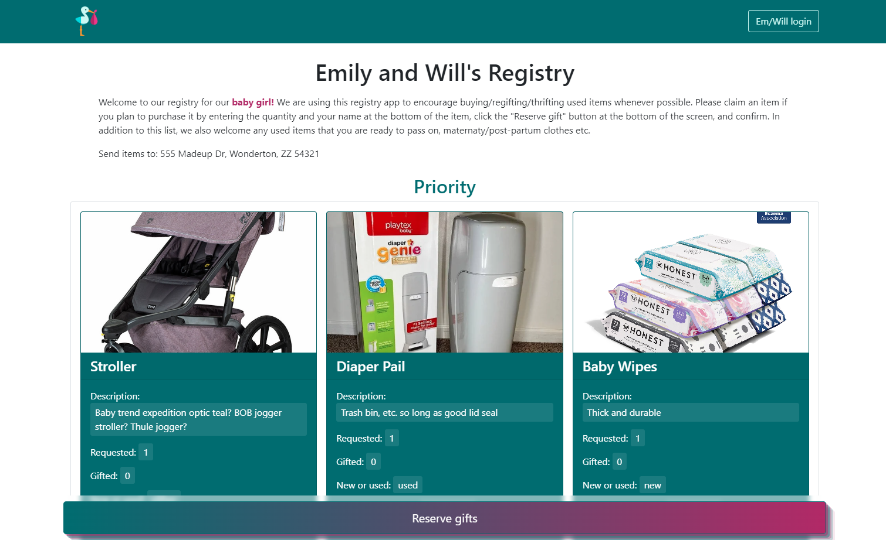
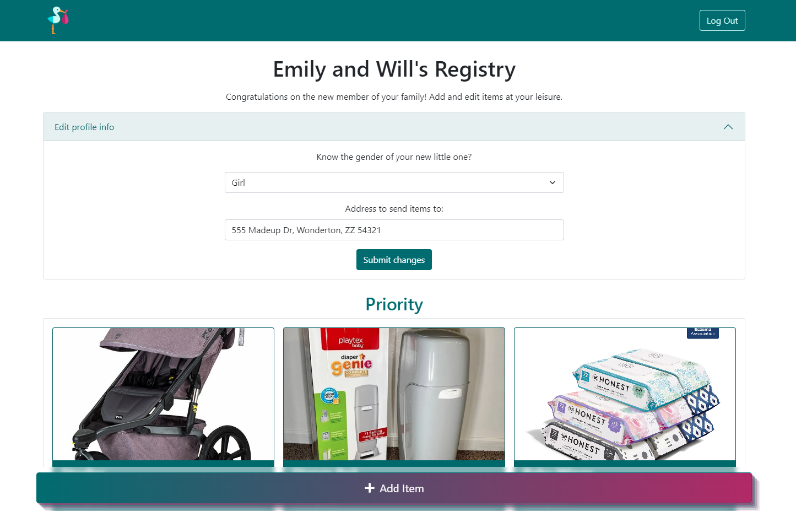
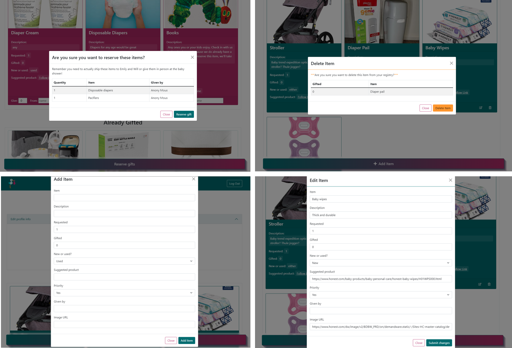

# Stork Registries - PERN App with Auth0 verification

A baby registry CRUD application developed using the PERN (PostgreSQL, Express, React and Node) stack, typescript, and Auth0 for login authentication. Deployed through Heroku. [View live here](https://stork-registries.herokuapp.com/).

## User Interface

The UI for this app was developed using React-Bootstrap with a custom color scheme, standard bootstrap classes, and custom CSS. Here are a few examples in various stages of operation.

_Stork Registries app when logged out._

_Stork Registries when logged in with user info accordian form expanded._

_Confirmation, delete, add and edit modals._

## Future Improvements

- Update app so anyone could create an account and launch their own registry.
  - Update database queries to accomodate different users' items, info, and login protocols
  - Incorporate/build out the home page
  - Add search functionality for different registries so people can find them
    - Establish url naming scheme
- Incorporate more form inputs for logged in user to control the intro and registry title text without having to hard code it.

## Clone it for your own Registry

1. Clone or download the repository. You should have the following installed to work with locally:

- [Node.js](https://nodejs.org/en/)
- [PostgreSQL](https://www.postgresql.org/download/)

2. In `Intro.tsx`, give your registry a different title within the `h1` element. Feel free to change the text in `IntroLoggedOut.tsx` as well (located in the same intro-text folder).
3. Create an [Auth0](https://auth0.com/signup?place=header&type=button&text=sign%20up) account and set up an application with localhost and your live URL in the allowed callback URLS.
4. Create a Postgres registry database and accompanying tables (copy and paste from `database.sql` file)
5. Create a `.env` file as shown in the `.env_sample` file with filled in values.
6. Follow along with [this tutorial](https://www.youtube.com/watch?v=ZJxUOOND5_A) by _The Stoic Programmers_ to host on heroku (\*\*\*note that heroku did away with their free tier hosting for 2023, so it will require a monthly payment)

## Technologies used

- [PostgreSQL](https://www.postgresql.org/)
- [Express](https://expressjs.com/)
- [React](https://reactjs.org/)
- [Node](https://nodejs.org/en/)
- [PG](https://www.npmjs.com/package/pg)
- [CORS](https://www.npmjs.com/package/cors)
- [Auth0](https://auth0.com/)
- [Heroku](https://www.heroku.com/)
- [Typescript](https://www.typescriptlang.org/)
- [React-Bootstrap](https://react-bootstrap.netlify.app/)
- [Bootstrap](https://getbootstrap.com/)
- [Create React App](https://github.com/facebook/create-react-app)
